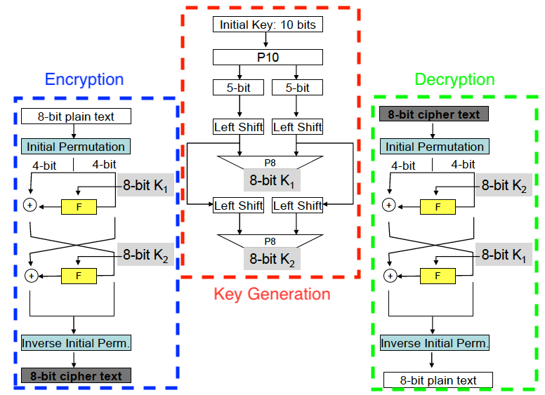

# CSCI6230-HW01-toy_DES
Data Encryption Standard (DES) is a typical block cipher. It has Feistel Cipher structure and the encryption and decryption are highly symmetric.

This homework implements a toy DES taking 8-bit input block and 10-bit key in [Python 3](https://www.python.org)
.


## Structure of DES
The diagrams of encryption,decryption and key-generation structures are shown in Fig. 1


The F function shown in both encryption and decryption structures (yellow box) is implemented as Fig. 2


Other parameters of the permutation blocks can be found in Fig. 3


## Code Structure
In the folder named _codes_ there are two files: _main.py_ and _DES.py_

_main.py_ is a short main program which includes:
* initialization of parameters of the toy DES
* creating random plaintext and initial key
* encryption and decryption

_DES.py_ implements a class named DES. Besides the standard constructor, the other functions can be classified into three parts:
* system-level related functions
* block-level related functions
* general operations

### System-level Related Functions
Functions in this part are related to
* parameters initialization

Parameters such as setting the number of rounds of the toy DES, initialization of the _Initial Permutation_ of the 8-bit plain text and _Inverse Initial Permutation_ before the output of cipher text are included in this part. Function related are:
``` Python
set_rounds(rounds)
set_init_P_table(array) # Set the initial permutation table. The input array can be numpy.array of list
print_init_P_table()
set_inv_P_table(array) # Set the inverse permutation table. The input array can be numpy.array of list
print_inv_P_table()
```

* encryption and decryption

Encryption and Decryption functions are classified in this part. Function related are:
```Python
encrypt(plaintext, key)
decryption(ciphertext, key)
```

### Block-level Related Functions
F function and Key generator are two blocks belong to this part.
* F function

F function contains an Expansion block, one XOR operator, two SBoxes with different tables, and one output permutation block. All of these blocks except the XOR operator do the substitution work. Note that, the substitution work is done by a permutation function following certain mapping table. What we need to implement is the table initialization and logical connection between blocks.

Functions related are
```Python
set_F_E_table(array) # set the expansion table of F function
print_F_E_table()
set_F_SBoxs_tables(arrays) # set the substitution tables of S box
print_F_SBoxs_tables()
F_SBox(inputs) # this function takes two 4-bit arrays and do the S box substitution
set_F_P_table(array)
print_F_P_table()
F_func(input, key) # this function takes in 4-bit input and 8-bit key and provides 4-bit output of the F function
```

* Key generator
Key generator contains two types of permutation blocks which do 10-bit and 8-bit permutations. Left shift is implemented by  ```numpy.roll()``` funtion.

Functions related are
```python
set_key_init_P_table(array) # set the 10-bit permutation table
print_key_init_P_table()
set_key_sub_P_table(array) # set the 8-bit permutation table
print_key_sub_P_table()
gen_keys(key) # takes 10-bit initial key and generate an array of 8-bit keys which match the number of rounds
```

### General Operations
OXR, permutations (also substitution), split to halves and left shift are used by many functions in class DES. XOR and left shift are implemented by using  ```numpy.logical_xor()``` and ```numpy.roll()``` respectively; permutations (also substitution) and split to halves are realized with for loops.

Function related are
```python
permutation(input, table)
left_shift(input)
XOR(input1, input2)
split_to_halves(input)
```

## Running Results
```
plaintext    : [1 1 0 1 0 0 1 0]
ciphertext   : [0 1 0 1 0 1 0 1]
plaintext rec: [1 1 0 1 0 0 1 0] # same as the plaintext
```
